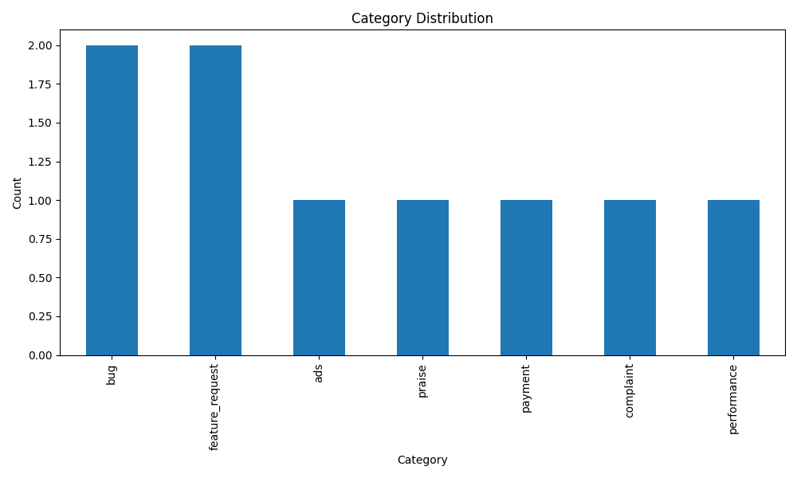
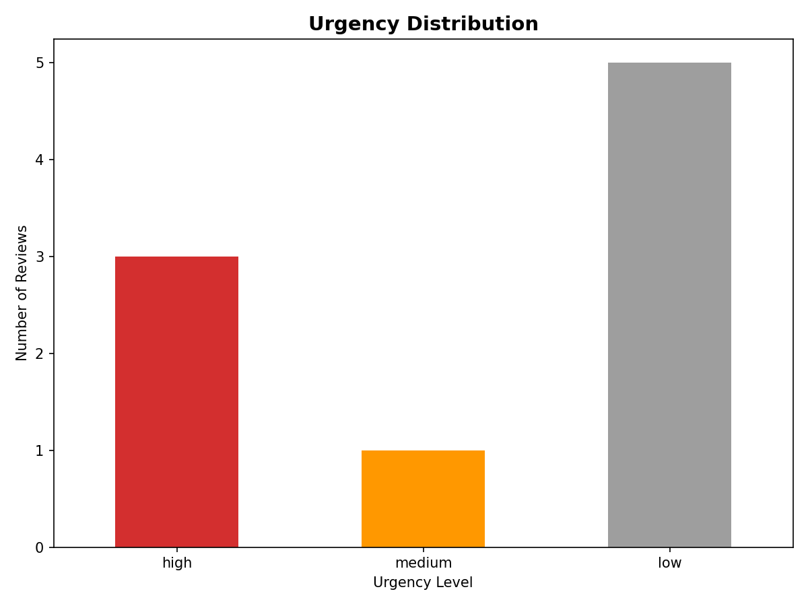

# Review Analyzer – Phase 2

End-to-end pipeline that processes app store reviews, produces structured analysis results, and generates prioritization artifacts to support product and QA decision-making.

Status: Phase 2 completed.

---

## Overview

This project takes raw app store reviews in CSV format and processes them through a structured pipeline:

- Cleans and normalizes raw review data
- Sends reviews to an LLM with a fixed output schema
- Produces structured, machine-readable results
- Adds priority scoring for issue triage
- Generates tabular and visual outputs for fast inspection

The pipeline is designed as a CLI-first data processing tool and can later be extended with automation or an API layer.

---

## Pipeline Flow

1. Load and clean raw reviews
2. Build minimal payloads per review
3. Run batch LLM analysis
4. Save structured results
5. Apply priority scoring (Phase 2)
6. Export top urgent reviews
7. Generate basic visual summaries

---

## Quick Start

### Setup

```bash
git clone https://github.com/mertcaralan/ai-review-analysis-pipeline.git
cd ai-review-analysis-pipeline

python -m venv .venv

# Windows
.venv\Scripts\activate

# Mac/Linux
source .venv/bin/activate

pip install -r requirements.txt
```

### Environment Variables

```bash
cp .env.example .env
```

Set the following variable:

```env
OPENAI_API_KEY=sk-your-api-key-here
```

### Run the Pipeline

```bash
python main.py
```

---

## Project Structure

```
ai-review-analysis-pipeline/
├─ app/
│  ├─ load_reviews.py        # Load and clean CSV input
│  ├─ analyze_reviews.py     # Build LLM payloads
│  ├─ schema.py              # Output schema (Pydantic)
│  ├─ prompts.py             # Prompt definitions
│  ├─ llm_client.py          # LLM client and parsing logic
│  ├─ run_batch.py           # Batch execution
│  ├─ priority.py            # Phase 2: priority scoring
│  └─ visualize.py           # Phase 2: charts and exports
├─ data/
│  ├─ input/
│  │  └─ reviews.csv
│  └─ output/
│     ├─ results.csv
│     ├─ top_urgent.csv
│     └─ charts/
│        ├─ category_distribution.png
│        └─ urgency_distribution.png
├─ main.py
├─ requirements.txt
├─ .env.example
└─ README.md
```

---

## Input Data

### `data/input/reviews.csv`

Raw user reviews.

Required columns:

* `review_id`
* `review_text`
* `rating` (1–5)
* `thumbs_up`

Example:

| review_id | review_text               | rating | thumbs_up |
| --------- | ------------------------- | ------ | --------- |
| rev_001   | App crashes after payment | 1      | 0         |
| rev_002   | Great game, love it       | 5      | 12        |

---

## Output Data

### Main Results

**File:** `data/output/results.csv`

Structured output produced by the LLM and enriched in Phase 2.

Columns:

* `review_id`
* `category`
* `urgency`
* `rating`
* `thumbs_up`
* `summary`
* `priority_score`

Sample:

| review_id | category    | urgency | rating | thumbs_up | priority_score | summary                   |
| --------- | ----------- | ------- | ------ | --------- | -------------- | ------------------------- |
| rev_001   | payment     | high    | 1      | 0         | 140            | App crashes after payment |
| rev_004   | performance | high    | 2      | 15        | 145            | Performance very slow     |

---

### Top Urgent Reviews

**File:** `data/output/top_urgent.csv`

Top 10 reviews sorted by `priority_score` in descending order.

Purpose: quick triage and escalation.

Columns:

* `review_id`
* `category`
* `urgency`
* `rating`
* `thumbs_up`
* `priority_score`
* `summary`

---

## Priority Scoring (Phase 2)

Priority score is computed to support backlog ordering.

Formula:

```
priority_score =
  urgency_weight
+ rating_penalty
+ thumbs_bonus
```

Where:

* urgency_weight: high = 100, medium = 50, low = 10
* rating_penalty: (5 - rating) * 10
* thumbs_bonus: min(thumbs_up, 50)

---

## Visual Outputs

Charts are generated automatically under `data/output/charts/`.

### Category Distribution

```
data/output/charts/category_distribution.png
```

Shows how reviews are distributed across issue categories.



---

### Urgency Distribution

```
data/output/charts/urgency_distribution.png
```

Shows urgency levels across all analyzed reviews.



---

## Design Notes

* LLM output is constrained to a fixed JSON schema.
* All outputs are validated before being written.
* The pipeline continues gracefully if a single review fails.
* Designed for reproducibility and auditability.

---

## Roadmap

**Phase 3**

* Slack or email reporting
* Scheduled execution

**Phase 4**

* FastAPI service layer
* External system integration

---

## Author

**Mert Çaralan**

GitHub: [https://github.com/mertcaralan](https://github.com/mertcaralan)
LinkedIn: [https://www.linkedin.com/in/mertcaralan/](https://www.linkedin.com/in/mertcaralan/)
