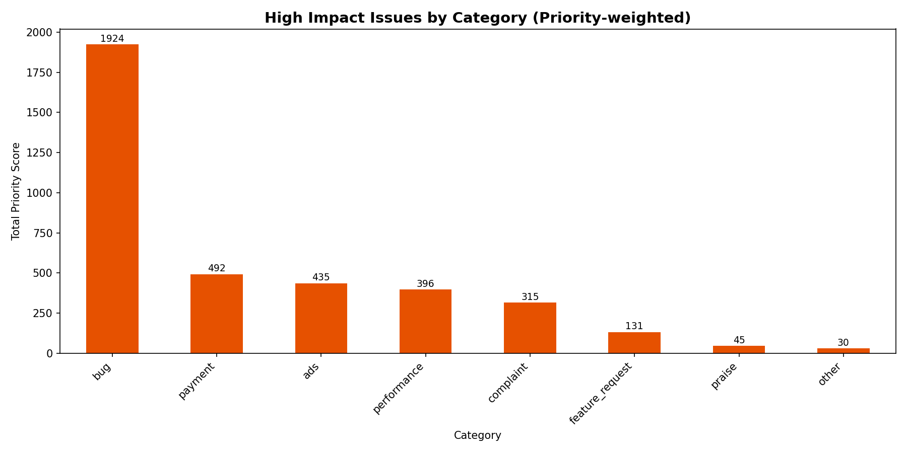
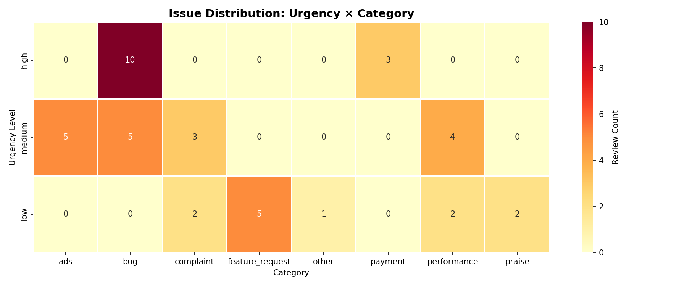
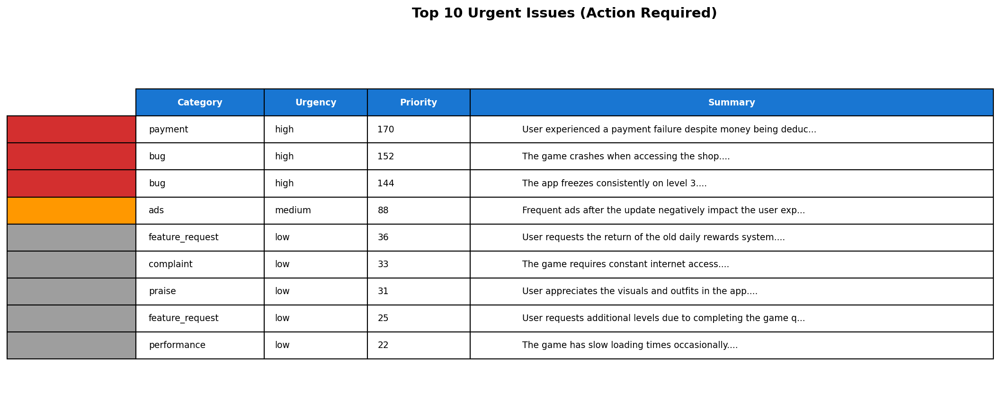

# Review Analyzer – Phase 2

End-to-end pipeline that processes app store reviews, produces structured analysis results, and generates prioritization artifacts to support product and QA decision-making.

Status: Phase 2 completed.

---

## Overview

This project takes raw app store reviews in CSV format and processes them through a structured pipeline:

* Cleans and normalizes raw review data
* Sends reviews to an LLM with a fixed output schema
* Produces structured, machine-readable results
* Adds priority scoring for issue triage
* Generates tabular and visual outputs for fast inspection

The pipeline is designed as a CLI-first data processing tool and can later be extended with automation or an API layer.

---

## Pipeline Flow

1. Load and clean raw reviews
2. Build minimal payloads per review
3. Run batch LLM analysis
4. Save structured results
5. Apply priority scoring (Phase 2)
6. Export top urgent reviews
7. Generate basic visual summaries

---

## Quick Start

### Setup

```bash
git clone https://github.com/mertcaralan/ai-review-analysis-pipeline.git
cd ai-review-analysis-pipeline

python -m venv .venv

# Windows
.venv\Scripts\activate

# Mac/Linux
source .venv/bin/activate

pip install -r requirements.txt
```

### Environment Variables

```bash
cp .env.example .env
```

Set the following variable:

```env
OPENAI_API_KEY=sk-your-api-key-here
```

### Run the Pipeline

**Basic usage:**
```bash
python main.py
```

**With options:**
```bash
# Export results as JSON
python main.py --export-json

# Filter by category
python main.py --category bug

# Filter by urgency
python main.py --urgency high

# Filter by minimum priority score
python main.py --min-priority 100

# Custom input/output paths
python main.py --input data/input/reviews.csv --output-dir data/output

# Combine filters
python main.py --category payment --urgency high --min-priority 120 --export-json

# Export to Excel
python main.py --export-excel

# Generate summary report
python main.py --generate-report

# Custom top N urgent reviews
python main.py --top-n 20

# All export formats
python main.py --export-json --export-excel --generate-report

# Search in summaries
python main.py --search "crash"

# Filter by rating range
python main.py --min-rating 3 --max-rating 5

# Quiet mode (minimal output)
python main.py --quiet

# Combine filters
python main.py --search "payment" --min-rating 1 --max-rating 2 --urgency high

# Use existing results (skip analysis)
python main.py --use-existing data/output/results.csv --category bug

# List available categories
python main.py --list-categories

# List available urgency levels
python main.py --list-urgencies

# Use existing results with custom path
python main.py --use-existing data/output/results.csv --export-json --generate-report

# Save results to database
python main.py --save-to-db

# List all analysis runs in database
python main.py --list-runs

# Compare two analysis runs
python main.py --compare-runs 1 2

# Trend analysis (last 30 days)
python main.py --trend-analysis 30

# Category trend analysis
python main.py --category-trend bug --trend-days 30
```

**Available options:**
- `--input`: Input CSV file path (default: `data/input/reviews.csv`)
- `--output-dir`: Output directory (default: `data/output`)
- `--category`: Filter by category (bug, payment, ads, performance, etc.)
- `--urgency`: Filter by urgency level (low, medium, high)
- `--min-priority`: Minimum priority score threshold
- `--search`: Search text in summary field (case-insensitive)
- `--min-rating`: Minimum rating filter (1-5)
- `--max-rating`: Maximum rating filter (1-5)
- `--export-json`: Export results as JSON in addition to CSV
- `--export-excel`: Export results as Excel (.xlsx) in addition to CSV
- `--top-n`: Number of top urgent reviews to export (default: 10)
- `--generate-report`: Generate a text summary report with statistics
- `--quiet`: Quiet mode - suppress non-essential output
- `--use-existing`: Use existing results CSV instead of running analysis
- `--list-categories`: List all available categories from existing results and exit
- `--list-urgencies`: List all available urgency levels from existing results and exit
- `--save-to-db`: Save results to SQLite database
- `--db-path`: Path to SQLite database file (default: `data/output/reviews.db`)
- `--list-runs`: List all analysis runs in database and exit
- `--compare-runs`: Compare two analysis runs (provide two run IDs)
- `--trend-analysis`: Show trend analysis for the last N days
- `--category-trend`: Show trend analysis for a specific category
- `--trend-days`: Number of days for trend analysis (default: 30)

---

## Project Structure

```
ai-review-analysis-pipeline/
├─ app/
│  ├─ load_reviews.py        # Load and clean CSV input
│  ├─ load_results.py        # Load existing analysis results
│  ├─ database.py            # SQLite database integration
│  ├─ analyze_reviews.py     # Build LLM payloads
│  ├─ schema.py              # Output schema (Pydantic)
│  ├─ prompts.py             # Prompt definitions
│  ├─ llm_client.py          # LLM client and parsing logic
│  ├─ run_batch.py           # Batch execution
│  ├─ priority.py            # Phase 2: priority scoring
│  ├─ visualize.py           # Phase 2: charts and exports
│  └─ report.py              # Summary report generation
├─ data/
│  ├─ input/
│  │  └─ reviews.csv
│  └─ output/
│     ├─ results.csv
│     ├─ results.json        # (with --export-json)
│     ├─ results.xlsx        # (with --export-excel)
│     ├─ top_urgent.csv
│     ├─ top_urgent.json
│     ├─ summary_report.txt  # (with --generate-report)
│     ├─ pipeline.log
│     ├─ reviews.db          # (with --save-to-db) SQLite database
│     └─ charts/
│        ├─ category_distribution.png
│        ├─ urgency_distribution.png
│        ├─ priority_weighted_category.png
│        ├─ urgency_category_heatmap.png
│        └─ top_urgent_table.png
├─ main.py
├─ requirements.txt
├─ .env.example
└─ README.md
```

---

## Input Data

File: [data/input/reviews.csv](data/input/reviews.csv)

Raw user reviews.
The test dataset may include duplicate rows or missing values to validate pipeline robustness.

Required columns:

* `review_id`
* `review_text`
* `rating` (1–5)
* `thumbs_up`
* `source` (`google_play` / `app_store`)

Example:

| review_id | review_text               | rating | thumbs_up |
| --------- | ------------------------- | ------ | --------- |
| rev_001   | App crashes after payment | 1      | 0         |
| rev_002   | Great game, love it       | 5      | 12        |

---

## Output Data

### Main Results

File: [data/output/results.csv](data/output/results.csv)

Structured output produced by the LLM and enriched in Phase 2.

Columns:

* `review_id`
* `category`
* `urgency`
* `rating`
* `thumbs_up`
* `summary`
* `priority_score`

Sample:

| review_id | category    | urgency | rating | thumbs_up | priority_score | summary                   |
| --------- | ----------- | ------- | ------ | --------- | -------------- | ------------------------- |
| rev_001   | payment     | high    | 1      | 0         | 140            | App crashes after payment |
| rev_004   | performance | high    | 2      | 15        | 145            | Performance very slow     |

---

### Top Urgent Reviews

File: [data/output/top_urgent.csv](data/output/top_urgent.csv)

Top N reviews (default: 10, customizable with `--top-n`) sorted by `priority_score` in descending order.

Purpose: quick triage and escalation.

Columns:

* `review_id`
* `category`
* `urgency`
* `rating`
* `thumbs_up`
* `priority_score`
* `summary`

**Note:** Also available as `top_urgent.json` for programmatic access.

---

### JSON Export

When using `--export-json` flag, results are also saved as:

* `data/output/results.json` - Full results in JSON format
* `data/output/top_urgent.json` - Top 10 urgent reviews in JSON format

JSON format is useful for:
* API integrations
* Programmatic data processing
* Web applications
* Data pipelines

---

### Logging

Pipeline execution is logged to:
* Console output (INFO level)
* `data/output/pipeline.log` file (detailed logs)

Logs include:
* Processing steps and timing
* Filtering operations
* Error messages and warnings
* Summary statistics

---

### Excel Export

When using `--export-excel` flag, results are also saved as:

* `data/output/results.xlsx` - Full results in Excel format

**Note:** Requires `openpyxl` package. Install with:
```bash
pip install openpyxl
```

Excel format is useful for:
* Manual data analysis in spreadsheet applications
* Sharing with non-technical stakeholders
* Advanced filtering and sorting
* Creating pivot tables

---

### Using Existing Results

Instead of running the full AI analysis (which can be expensive and time-consuming), you can work with previously generated results:

**Use existing results:**
```bash
python main.py --use-existing data/output/results.csv --category bug
```

This is useful when you want to:
* Apply different filters to already analyzed data
* Export in different formats without re-analyzing
* Generate reports from existing results
* Save API costs and time

**List available categories:**
```bash
python main.py --list-categories
```

Output:
```
Available Categories:
----------------------------------------
  ads                  (5 reviews)
  bug                  (15 reviews)
  complaint            (5 reviews)
  feature_request      (5 reviews)
  ...
```

**List available urgency levels:**
```bash
python main.py --list-urgencies
```

**Combine with other options:**
```bash
# Filter existing results and export to Excel
python main.py --use-existing data/output/results.csv --category bug --export-excel

# Generate report from existing results
python main.py --use-existing data/output/results.csv --generate-report

# Search in existing results
python main.py --use-existing data/output/results.csv --search "crash"
```

---

### Summary Report

When using `--generate-report` flag, a text summary report is generated:

* `data/output/summary_report.txt` - Comprehensive statistics report

The report includes:
* Overview statistics (total reviews, average rating)
* Priority score statistics (average, min, max)
* Category distribution with percentages
* Urgency distribution with percentages
* Top categories by total priority score
* Critical issues count (high urgency + low rating)

Perfect for:
* Quick overview without opening files
* Sharing in emails or documentation
* Executive summaries
* Historical comparison

---

## Priority Scoring (Phase 2)

Priority score is computed to support backlog ordering.

Formula:

```
priority_score =
  urgency_weight
+ rating_penalty
+ thumbs_bonus
```

Where:

* urgency_weight: high = 100, medium = 50, low = 10
* rating_penalty: (5 - rating) * 10
* thumbs_bonus: min(thumbs_up, 50)

### Robustness Notes

To ensure the pipeline does not break on imperfect datasets, **defensive defaults** are applied:

* If `rating` is missing or non-numeric → default **3**
* If `thumbs_up` is missing or invalid → default **0**

---

## Visual Outputs

Charts are generated automatically under `data/output/charts/`.

### Category Distribution

Shows how reviews are distributed across issue categories.


---

### Urgency Distribution

Shows urgency levels across all analyzed reviews.


---

### Priority-Weighted Category Impact

Highlights categories with the highest cumulative impact based on priority scoring.



---

### Urgency × Category Heatmap

Helps identify where high-urgency issues are concentrated.



---

### Top 10 Urgent Issues (Shareable Table)

Slack-ready visual table for quick escalation.



---

## Dependencies

### Visualization Dependencies

The visualization layer introduces the following dependencies:

* `matplotlib`
* `seaborn`

---

## Design Notes

* LLM output is constrained to a fixed JSON schema.
* All outputs are validated before being written.
* The pipeline continues gracefully if a single review fails.
* Designed for reproducibility and auditability.
* Comprehensive logging for debugging and monitoring.
* Flexible filtering options for targeted analysis.
* Multiple export formats (CSV, JSON, Excel) for different use cases.
* Flexible filtering options (category, urgency, priority, rating, text search).
* Quiet mode for automated/scripted usage.
* Reuse existing results without re-running expensive AI analysis.
* List available categories and urgency levels for exploration.
* SQLite database integration for historical tracking and trend analysis.
* Compare analysis runs to track changes over time.
* Trend analysis for categories, urgency, and ratings.

---

## Database Integration

The pipeline supports SQLite database integration for storing and analyzing historical review data.

### Features

* **Persistent Storage**: Save all analysis results to SQLite database
* **Run Tracking**: Each analysis run is tracked with timestamp and metadata
* **Historical Comparison**: Compare different analysis runs to see changes over time
* **Trend Analysis**: Analyze trends in categories, urgency, and ratings over time
* **Category Trends**: Track specific category trends over time

### Database Schema

The database includes two main tables:

1. **analysis_runs**: Tracks each analysis execution
   - `run_id`: Unique identifier
   - `timestamp`: When the analysis was run
   - `total_reviews`: Number of reviews analyzed
   - `notes`: Optional notes

2. **reviews**: Stores individual review analyses
   - All review data (category, urgency, rating, priority_score, etc.)
   - Linked to analysis_runs via `run_id`
   - Timestamped for trend analysis

### Usage Examples

**Save results to database:**
```bash
python main.py --save-to-db
```

**List all analysis runs:**
```bash
python main.py --list-runs
```

Output:
```
Analysis Runs:
======================================================================
Run ID:   1 | 2026-01-15T10:00:00 | Reviews:  42 | Notes: N/A
Run ID:   2 | 2026-01-16T10:00:00 | Reviews:  45 | Notes: N/A
Run ID:   3 | 2026-01-17T10:00:00 | Reviews:  43 | Notes: N/A
```

**Compare two runs:**
```bash
python main.py --compare-runs 1 2
```

This shows:
* Category distribution changes
* Urgency level changes
* Average priority and rating changes
* Percentage changes for each metric

**Trend analysis:**
```bash
# Last 30 days
python main.py --trend-analysis 30

# Last 7 days
python main.py --trend-analysis 7
```

**Category-specific trends:**
```bash
# Bug category trends over last 30 days
python main.py --category-trend bug --trend-days 30

# Payment category trends
python main.py --category-trend payment
```

### Database Location

By default, the database is stored at:
```
data/output/reviews.db
```

You can specify a custom location:
```bash
python main.py --save-to-db --db-path /path/to/custom/reviews.db
```

### Benefits

* **Historical Tracking**: Keep all analysis results for comparison
* **Trend Detection**: Identify patterns and changes over time
* **Performance Monitoring**: Track how issues evolve
* **Data Persistence**: Never lose analysis results
* **Efficient Queries**: Fast access to historical data

### Workflow Example

```bash
# Day 1: Run analysis and save to database
python main.py --save-to-db

# Day 2: Run another analysis
python main.py --save-to-db

# Compare Day 1 vs Day 2
python main.py --compare-runs 1 2

# Check bug trends over last week
python main.py --category-trend bug --trend-days 7

# Overall trend analysis
python main.py --trend-analysis 30
```

---

## Example Pipeline Run (CLI Output)

Below is a sample terminal output from a successful end-to-end run:

```text
[1/3] Loading reviews...
Reviews cleaned: 50 → 42
42 reviews loaded

[2/3] Building payloads...
42 payloads ready

[3/3] Running AI analysis...
Analyzing: 100%|████████████████████████| 42/42 [01:24<00:00,  2.00s/it]

[Phase 2] Adding priority scores...
Results saved: data/output/results.csv
Top 10 urgent saved: data/output/top_urgent.csv
Charts saved: data/output/charts/

Summary:
Categories: {'bug': 15, 'performance': 6, 'feature_request': 5, 'ads': 5, 'complaint': 5, 'payment': 3, 'praise': 2, 'other': 1}
Urgency: {'medium': 17, 'high': 13, 'low': 12}
```

This output demonstrates that the pipeline runs end-to-end and produces all expected artifacts.

---

## Roadmap

**Phase 3**

* Slack or email reporting
* Scheduled execution

**Phase 4**

* FastAPI service layer
* External system integration

---

## Author

**Mert Çaralan**

GitHub: [https://github.com/mertcaralan](https://github.com/mertcaralan)
LinkedIn: [https://www.linkedin.com/in/mertcaralan/](https://www.linkedin.com/in/mertcaralan/)
