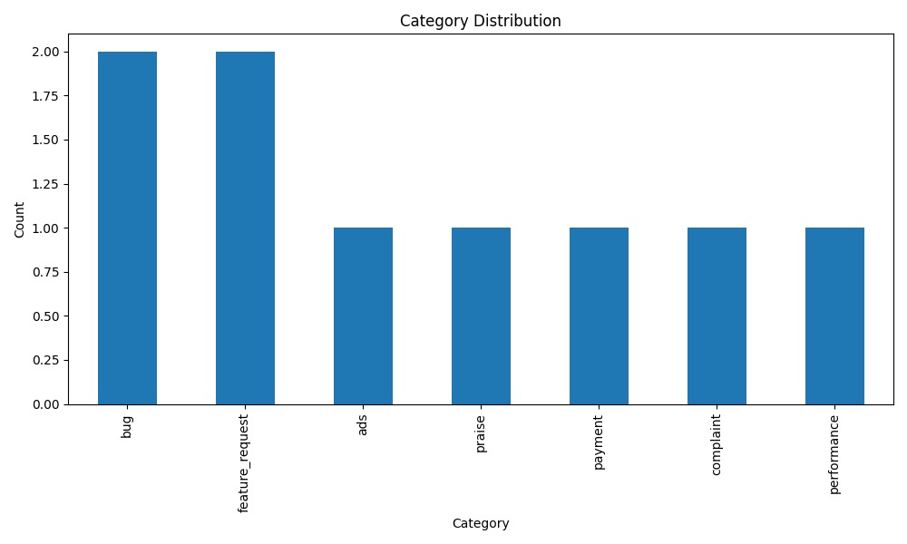
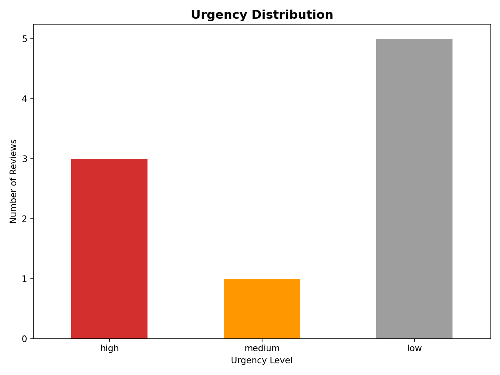
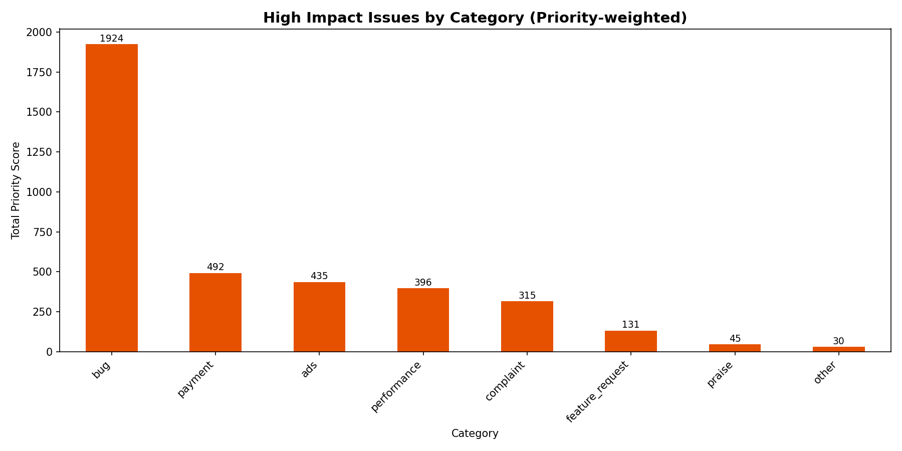
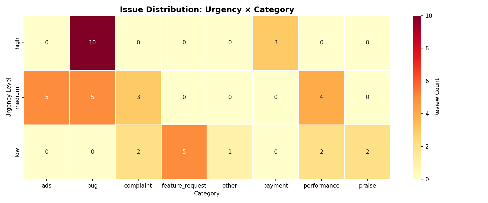
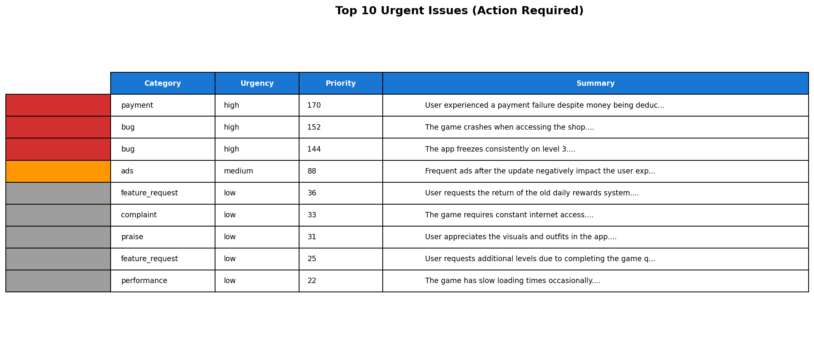

# Review Analyzer – Phase 3

End-to-end pipeline that processes app store reviews, produces structured analysis results, and generates prioritization artifacts to support product and QA decision-making.

Status: Phase 3 completed. FastAPI service layer implemented as an MVP.

---

## Overview

This project processes raw app store reviews in CSV format through a structured analysis pipeline.

It supports two execution modes:

* CLI mode for local batch processing
* API mode via FastAPI for dataset management, run execution, and result retrieval

The pipeline is designed to be deterministic, auditable, and easily extensible toward production-grade integrations.

---

## Pipeline Flow

1. Load and clean raw reviews
2. Build minimal payloads per review
3. Run batch LLM analysis
4. Save structured results
5. Apply priority scoring
6. Export top urgent reviews
7. Generate visual summaries

The same core pipeline logic is reused in both CLI and API execution paths.

---

## Quick Start

### Setup

```bash
git clone https://github.com/mertcaralan/ai-review-analysis-pipeline.git
cd ai-review-analysis-pipeline

python -m venv .venv

# Windows
.venv\Scripts\activate

# Mac/Linux
source .venv/bin/activate

pip install -r requirements.txt
```

### Environment Variables

```bash
cp .env.example .env
```

Set the following variable:

```env
OPENAI_API_KEY=sk-your-api-key-here
```

## Running the Pipeline

### CLI Mode

```bash
python main.py
```

CLI execution writes outputs under:

```
data/output/
```

---

### API Mode (FastAPI)

```bash
uvicorn api.main:app --reload --port 8000
```

Open:

* [http://localhost:8000](http://localhost:8000)
* [http://localhost:8000/docs](http://localhost:8000/docs)

---

## API Usage (FastAPI)

The API exposes endpoints for dataset upload, run execution, result retrieval, and chart serving.

Runs execute asynchronously in the background. Status and logs can be polled during execution.

### Core Endpoints

* `GET /health`
  API health status and OpenAI configuration check.

* `POST /datasets`
  Upload a CSV dataset. The file is cleaned using the existing pipeline logic.

* `GET /datasets`
  List uploaded datasets.

* `GET /datasets/{dataset_id}?n_rows=10`
  Retrieve dataset metadata with a preview of cleaned rows.

* `DELETE /datasets/{dataset_id}`
  Delete a dataset and its stored file.

* `POST /runs`
  Create and start an analysis run for a dataset.

* `GET /runs/{run_id}`
  Poll run status and progress.

* `GET /runs/{run_id}/logs`
  Retrieve execution logs.

* `GET /runs/{run_id}/results`
  Retrieve filtered and paginated results.

* `GET /runs/{run_id}/top-urgent`
  Retrieve top urgent reviews by priority score.

* `GET /runs/{run_id}/exports/results.csv`
  Download full results as CSV.

* `GET /runs/{run_id}/exports/top_urgent.csv`
  Download top urgent results as CSV.

* `GET /runs/{run_id}/charts`
  List generated charts.

* `GET /runs/{run_id}/charts/{chart_name}`
  Serve chart images (PNG).

---

### Example API Request

Create a run for an uploaded dataset:

```bash
curl -X POST http://localhost:8000/runs \
  -H "Content-Type: application/json" \
  -d '{
    "dataset_id": "<dataset_id>",
    "max_reviews": 50
  }'
```

---

### API Storage Notes

The FastAPI layer writes files under:

```
storage/datasets/
storage/runs/{run_id}/
```

This directory is ignored by git.

Note:
The API layer is intentionally implemented as an MVP. Dataset and run metadata are stored in-memory to prioritize pipeline integration and API ergonomics over persistence. This can be replaced with a database-backed store in a later phase.

---

## Project Structure

```
ai-review-analysis-pipeline/
├─ api/
│  ├─ routers/
│  │  ├─ __init__.py
│  │  ├─ health.py           # Health check endpoints
│  │  ├─ meta.py             # Output schema metadata endpoints
│  │  ├─ datasets.py         # Dataset upload and management endpoints
│  │  ├─ runs.py             # Run lifecycle endpoints
│  │  └─ results.py          # Results, exports, and charts endpoints
│  ├─ schemas/
│  │  ├─ __init__.py
│  │  ├─ common.py           # Shared response models
│  │  ├─ datasets.py         # Dataset request/response schemas
│  │  ├─ runs.py             # Run request/response schemas
│  │  └─ results.py          # Results and charts schemas
│  ├─ services/
│  │  ├─ __init__.py
│  │  ├─ dataset_service.py  # Dataset management and cleaning logic
│  │  ├─ pipeline_service.py # Orchestrates app/* pipeline modules
│  │  ├─ run_service.py      # Run lifecycle and result retrieval logic
│  │  └─ storage_service.py  # File system operations
│  ├─ storage/
│  │  ├─ __init__.py
│  │  ├─ in_memory.py        # In-memory metadata store (MVP)
│  │  └─ models.py           # Dataset and Run dataclasses
│  ├─ __init__.py
│  ├─ config.py              # API configuration (.env via pydantic-settings)
│  ├─ deps.py                # FastAPI dependency injection
│  └─ main.py                # FastAPI app entry point
├─ app/
│  ├─ load_reviews.py        # Load and clean CSV input
│  ├─ analyze_reviews.py     # Build LLM payloads
│  ├─ schema.py              # Output schema (Pydantic)
│  ├─ prompts.py             # Prompt definitions
│  ├─ llm_client.py          # LLM client and parsing logic
│  ├─ run_batch.py           # Batch execution
│  ├─ priority.py            # Phase 2: priority scoring
│  └─ visualize.py           # Phase 2: charts and exports
├─ data/
│  ├─ input/
│  │  └─ reviews.csv
│  └─ output/
│     ├─ results.csv
│     ├─ top_urgent.csv
│     └─ charts/
│        ├─ category_distribution.png
│        ├─ urgency_distribution.png
│        ├─ priority_weighted_category.png
│        ├─ urgency_category_heatmap.png
│        └─ top_urgent_table.png
├─ storage/                  # API-generated datasets and run outputs (gitignored)
├─ main.py
├─ requirements.txt
├─ .env.example
└─ README.md
```

---

## Input Data

File: [data/input/reviews.csv](data/input/reviews.csv)

Raw user reviews.
The test dataset may include duplicate rows or missing values to validate pipeline robustness.

Required columns:

* `review_id`
* `review_text`
* `rating` (1–5)
* `thumbs_up`
* `source` (`google_play` / `app_store`)

Example:

| review_id | review_text               | rating | thumbs_up |
| --------- | ------------------------- | ------ | --------- |
| rev_001   | App crashes after payment | 1      | 0         |
| rev_002   | Great game, love it       | 5      | 12        |

---

## Output Data

### Main Results

File: [data/output/results.csv](data/output/results.csv)

Structured output produced by the LLM and enriched in Phase 2.

Columns:

* `review_id`
* `category`
* `urgency`
* `rating`
* `thumbs_up`
* `summary`
* `priority_score`

Sample:

| review_id | category    | urgency | rating | thumbs_up | priority_score | summary                   |
| --------- | ----------- | ------- | ------ | --------- | -------------- | ------------------------- |
| rev_001   | payment     | high    | 1      | 0         | 140            | App crashes after payment |
| rev_004   | performance | high    | 2      | 15        | 145            | Performance very slow     |

---

### Top Urgent Reviews

File: [data/output/top_urgent.csv](data/output/top_urgent.csv)

Top 10 reviews sorted by `priority_score` in descending order.

Purpose: quick triage and escalation.

Columns:

* `review_id`
* `category`
* `urgency`
* `rating`
* `thumbs_up`
* `priority_score`
* `summary`

---

## Priority Scoring

Priority score is computed to support backlog ordering.

Formula:

```
priority_score =
  urgency_weight
+ rating_penalty
+ thumbs_bonus
```

Where:

* urgency_weight: high = 100, medium = 50, low = 10
* rating_penalty: (5 - rating) * 10
* thumbs_bonus: min(thumbs_up, 50)

### Robustness Notes

To ensure the pipeline does not break on imperfect datasets, **defensive defaults** are applied:

* If `rating` is missing or non-numeric → default **3**
* If `thumbs_up` is missing or invalid → default **0**

---

## Visual Outputs

Charts are generated automatically under `data/output/charts/`.

### Category Distribution

Shows how reviews are distributed across issue categories.



---

### Urgency Distribution

Shows urgency levels across all analyzed reviews.



---

### Priority-Weighted Category Impact

Highlights categories with the highest cumulative impact based on priority scoring.



---

### Urgency × Category Heatmap

Helps identify where high-urgency issues are concentrated.



---

### Top 10 Urgent Issues (Shareable Table)

Slack-ready visual table for quick escalation.



---

## Dependencies

### Core

* `pandas`
* `openai`
* `pydantic`

### Visualization

* `matplotlib`
* `seaborn`

### API

* `fastapi`
* `uvicorn[standard]`
* `python-multipart`
* `pydantic-settings`

---

## Design Notes

* LLM output is constrained to a fixed JSON schema.
* All outputs are validated before being written.
* The pipeline continues gracefully if a single review fails.
* Existing `app/` modules are reused without modification.
* API runs are isolated per execution.
* Designed for reproducibility and auditability.

---

## Example Pipeline Run (CLI Output)

Below is a sample terminal output from a successful end-to-end run:

```text
[1/3] Loading reviews...
Reviews cleaned: 50 → 42
42 reviews loaded

[2/3] Building payloads...
42 payloads ready

[3/3] Running AI analysis...
Analyzing: 100%|████████████████████████| 42/42 [01:24<00:00,  2.00s/it]

[Phase 2] Adding priority scores...
Results saved: data/output/results.csv
Top 10 urgent saved: data/output/top_urgent.csv
Charts saved: data/output/charts/

Summary:
Categories: {'bug': 15, 'performance': 6, 'feature_request': 5, 'ads': 5, 'complaint': 5, 'payment': 3, 'praise': 2, 'other': 1}
Urgency: {'medium': 17, 'high': 13, 'low': 12}
```

This output demonstrates that the pipeline runs end-to-end and produces all expected artifacts.

---

## Roadmap

### Phase 4

* Slack and email reporting
* Scheduled execution (cron / queue-based)
* Persistent storage for metadata
* Authentication and multi-user support
* External system integration

---

## Author

**Mert Çaralan**

Information Systems and Technologies / AI and Data Engineering Focus

GitHub: [https://github.com/mertcaralan](https://github.com/mertcaralan)
LinkedIn: [https://www.linkedin.com/in/mertcaralan/](https://www.linkedin.com/in/mertcaralan/)
